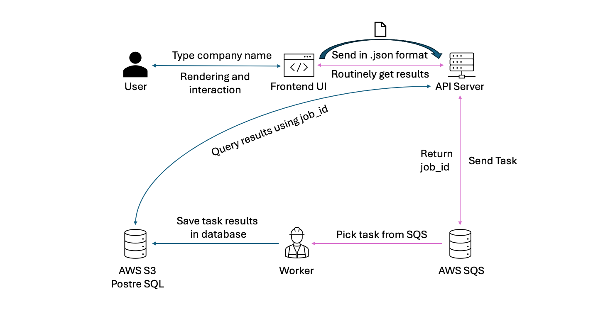
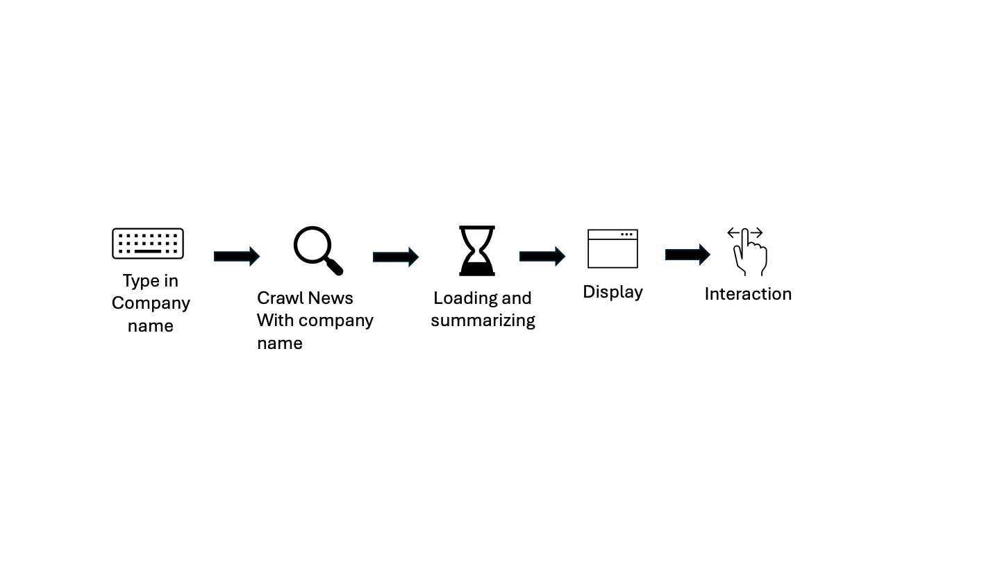

# Finance News Summary System

## System Architecture


```
task queue: Docker Redis
```
1. client先把資料丟給server, server建立job and job_id, 並把job丟到docker redis, 並把job_id回傳給client
2. 後端的ARQ worker從redis中抓取task來做, 做完之後先存到database, commit之後再將task status更新到redis
3. Client在跟server要結果的時候, 可以先去redis找job status (redis當作一個cache), 確定task is done, 再跟database query result
4. 如果redis內的job status已經expired, 就去資料庫query

## Worker pipeline


## Quick Start
```
./scripts/dev.sh
```
This will run the full-stack async system.

```
python news_url_collector.py --query keyword --start_data YY-MM-DD --end_date YY-MM-DD --language en --sort_by relevancy --page 1
```
This script will use newsapi to get urls of news with keyword

```
python news_crawler.py --url_file_name url.json --workers num_workers
```
This script will use url in url.json to request html code, and then use trafilatura to extract the content. num_workers is the parameter that can use multi thread requests. Faster

```
python summary_BART.py --num_beams 2 --max_output_length 60 --batch_size 4
```
This script will use the content in news.json, and summarize each news. num_beams controls the quality of summary, max_output_length regarding the length of summary, batch_size is related to parallel summarizing.